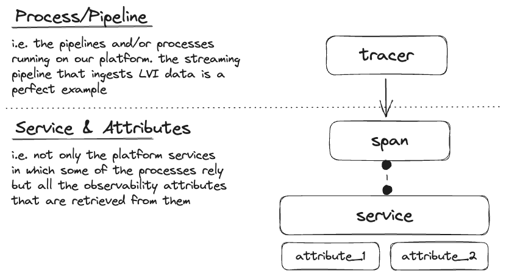
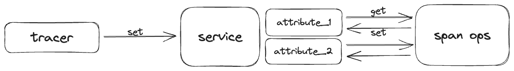

<!-- <p align='center'>
    
</p> -->

<h1 align='center'>
    <strong> Telescope </strong>
</h1>

<p align='center'>
    Designed to be the "big brother" of your running pipelines - allow the ghosts to get into your stack but make sure they don't get out without a fair punishment. 
</p>

<div align="center">

  <a href="code coverage"></a>
  <a href="tests"></a>
  <a href="opentelemetry version"></a>
  <a href="python version"></a>

</div>

<div align="center">

  <a href="tests"></a>
  <a href="tests"></a>
  <a href="tests"></a>

</div>

### **1. Introduction**

This solution works not only like a wrapper around the observability core functionalities of open telemetry but also works like a **_plug-and-play_ solution** where you spend less time worrying not only about the configuration of this tool but also about the connection with your platform.

### **2. Components Structure and Hierarchization**

<p align='center'>
    
</p>

We have two hierarchical dimensions on this solution, both of which are part of the open telemetry:
1. `tracers` - create spans containing more information about what is happening for a given operation, these are created from Tracer Providers. Our specific solution is the personification of pipelines running on our platform like the one mentioned in the image above;
2. `spans` - represents a unit of work or operation. In this specific case, leverage the following naming convention:

````
{service_name}.{resource_type_monitored}.{OPTIONAL_var_name}
````

this point out the services where these spans are being created and the type of attributes they provide. Here are a few examples: 

````
databricks.df.LVI
databricks.df
databricks.SparkSession.eda
azure_function_app.api.maritime
````

### **3. Concept of Action**

This section answers the question: _"How does this all work together?"_ and the next image pictures the relationships that are established between the multiple components.

<p align='center'>
    
</p>

The middle sector - where the heart of the operation takes action -, is responsible for calling all the modules upon which this solution is built on top of. This sector is the sector where all the attributes are defined as well as the structure of the span (more specifically the naming convention).

The course of action starts with this sector getting the resource that is at the top of the hierarchy - the tracer. It is on top of this resource that the span will be created and from the framework is in position to call the Service Span to add the attributes determined from the resources provided by the user.

### **4. Actions per hierarchy**
This framework leverages Manual Instrumentation completely.

#### **4.a. PipelineTracer**
This unit is responsible for the configuration of the tracer (actions like the configuration of the type processor and exporter). A baseline tracer is created and from that one, multiple tracers with different tracer_ids - defined by the user -, are created.

Here are the following actions supported:

- `get_tracer`: method used for the creation of new tracers;
- `_set_exporter_type`: at the moment only one exporter type is supported: `CONSOLE`;
- `_create_processor`: there's two kinds of processors that are supported: `BATCH` and `SIMPLE`.
#### **4.b. Attributes**
It's important to highlight that regarding attributes we can have monitorization at two different levels:
- **resources** - where you'll retrieve features from the variables provided to the telescope module;
- **operations** - where a monitorization is granted either to the input or output of a certain operation.

More attributes will be added in the near future.
### **5. How to Use - _high level_**

As it can be seen in the [engine.py](./engine.py) script - that intends to be a high-level example that congregates all the elements of the solution -, the **Telescope** can be used in two different ways - as the next code snippet illustrates:

- _Observability at the **resource level**_:
````python
# create the tracer
tracer = PipelineTracer(
    processor_type='BATCH', # default value - illustration purposes
    exporter_type='CONSOLE' # default value - illustration purposes
).get_tracer('engine_test')

# set attributes
TelescopeSparkResources(tracer, 'local_computer', spark, 'test_session')
TelescopeSparkResources(tracer, 'local_computer',df ,'test_data')
````

- _Observability at the **operation level**_:
````python
# create the tracer
tracer = PipelineTracer(
    processor_type='BATCH', # default value - illustration purposes
    exporter_type='CONSOLE' # default value - illustration purposes
).get_tracer('engine_test')

# initialize the telescope
telescope = TelescopeSparkOperations(tracer, 'databricks')

# define the operation
@telescope.df_operation('test_inner_join')
def inner_join(df1, df2):
    return df1.join(df2, on='id', how='inner')

# call the operation
inner_join(df1, df2)
````

And the `inner_join` operation will be monitored by the Telescope.

**_More documentation will be added in the near future on this._**

### **A1. Future Work**

There are still some points that we should tackle:

- test this solution in a 'production' scenario i.e. leverage it in resources like Azure Function App, Databricks notebooks, and/or scripts and see the behavior. As an example, we could clone the streaming pipeline that is now in production but make some adaptations so that this clone leverages the solution produced;

- gather with the Engineering team to define a set of attributes that would be nice to add to this solution (billing metrics and performance - which were already mentioned in some calls - should be held into account);

- analyze if Zipkin can be a good option to visualize this observability data.